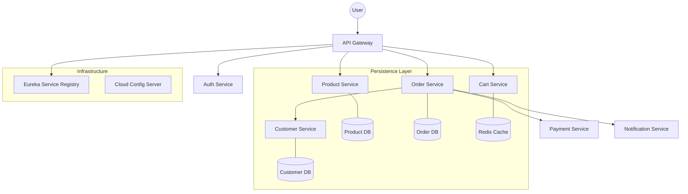

# 🛒 Enterprise E-Commerce Microservices Ecosystem

[](https://github.com/vanilson/e-commerce-microservice/actions)
[](https://spring.io/projects/spring-boot)
[](LICENSE)

An enterprise-grade, cloud-native e-commerce platform built with a highly decoupled microservices architecture. This project demonstrates industrial-strength patterns for scalability, resilience, and automated delivery.

---

## 🏗️ Architecture Overview

The system is designed following the **Microservices Pattern** with a decentralized data strategy, utilizing both Relational and NoSQL databases, centralized configuration, and edge-gateway patterns.



---

## 🚀 Core Microservices

| Service | Responsibility | Technology |
| :--- | :--- | :--- |
| **API Gateway** | Entry point, routing, and security. | Spring Cloud Gateway |
| **Discovery Service** | Service registration and heartbeat monitoring. | Netflix Eureka |
| **Config Service** | Centralized, environment-specific configuration. | Spring Cloud Config |
| **Auth Service** | Identity management and JWT-based security. | Spring Security / JJWT |
| **Customer Service** | Profile management and address tracking. | MongoDB / REST |
| **Product Service** | Catalog management and inventory lookups. | MongoDB / REST |
| **Order Service** | Orchestration of the checkout process. | PostgreSQL / JPA |
| **Cart Service** | High-performance temporary storage. | Redis / Spring Data Redis |
| **Payment Service** | Transaction processing and status tracking. | PostgreSQL / REST |
| **Notification Service** | Multi-channel user alerting. | MongoDB / Actuator |

---

## 🛠️ Tech Stack & Engineering Standards

- **Core Framework:** Spring Boot 3.2.5 (Java 17)
- **Service Mesh & Discovery:** Spring Cloud (2023.0.1)
- **Data Persistence:**
    - **NoSQL:** MongoDB (High-performance cataloging)
    - **Caching:** Redis (Session & Cart management)
    - **Relational:** PostgreSQL (Transactional integrity)
- **Quality Assurance:** 
    - **Unit Testing:** JUnit 5 & Mockito
    - **Integration Testing:** **Testcontainers** (Real Docker instances for Mongo/Redis in CI)
- **CI/CD:** GitHub Actions with Dockerized builds and automated Maven reactor management.

---

## ⚡ Getting Started

### Prerequisites
- Docker & Docker Compose
- Java 17+
- Maven 3.8+

### One-Command Deployment
Launch the entire ecosystem (including infrastructure and all services):
```bash
docker-compose up -d
```

### Manual Build (Maven Reactor)
The project uses a multi-module Maven setup. To build all services from the root:
```bash
mvn clean package -DskipTests
```

---

## 📖 API Documentation

Each microservice exposes its own **Swagger UI** for interactive API exploration. Once running, access them via:

- **Customer API:** `http://localhost:8040/swagger-ui.html`
- **Product API:** `http://localhost:8050/swagger-ui.html`
- **Order API:** `http://localhost:8060/swagger-ui.html`
- **Gateway Dashboard:** `http://localhost:8222/actuator/health`

---

## 🛣️ Roadmap & Future Enhancements
- [ ] Implement Kafka for Event-Driven updates.
- [ ] Add Prometheus & Grafana dashboards for observability.
- [ ] Integrate SaaS Multi-Tenancy patterns across all modules.

---

## 🤝 Contribution & License
Contributions are what make the open-source community such an amazing place to learn, inspire, and create. Any contributions you make are **greatly appreciated**.

Distributed under the MIT License. See `LICENSE` for more information.

---
*Developed with a focus on Engineering Excellence and Scalability.*
