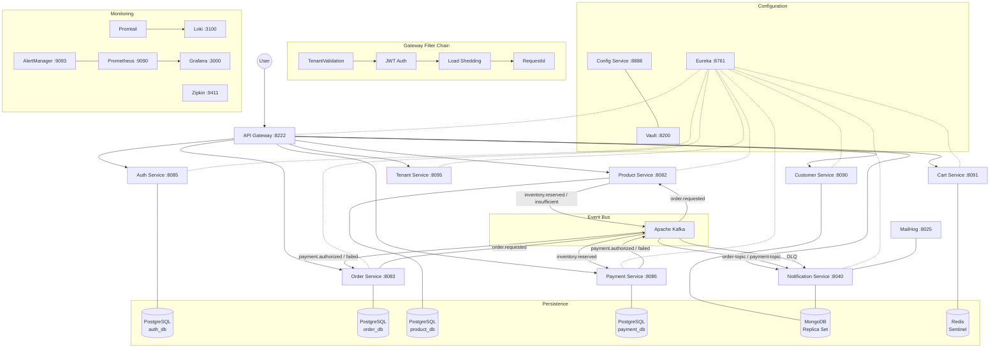
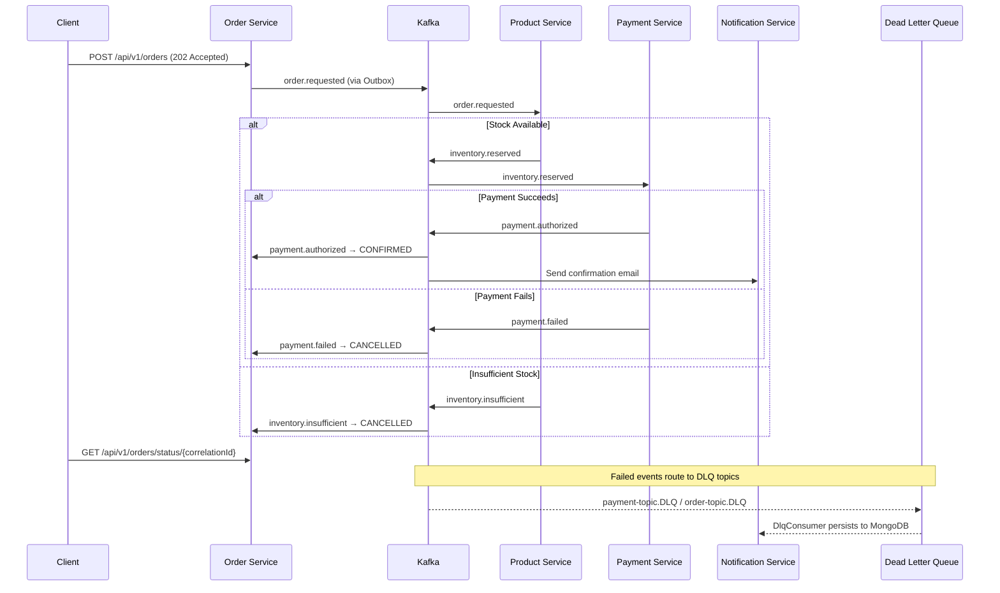
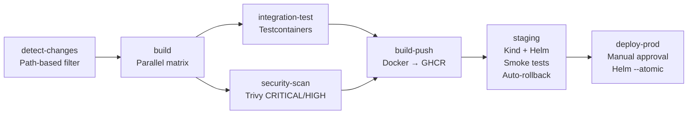

# Enterprise E-Commerce Microservices Platform

[](https://github.com/vanilson/e-commerce-microservice/actions)
[](https://spring.io/projects/spring-boot)
[](https://openjdk.org/projects/jdk/17/)
[](https://spring.io/projects/spring-cloud)
[](LICENSE)
[](https://docs.docker.com/compose/)
[](https://helm.sh/)

A production-grade, cloud-native SaaS e-commerce platform built with 12 Spring Boot microservices. Features event-driven choreography saga, transactional outbox, multi-tenant isolation, full observability (Prometheus, Grafana, Loki, Zipkin), Vault secrets management, and GitOps delivery via Helm to Kubernetes.

---

## Architecture Overview



---

## Choreography Saga Flow

The order processing pipeline uses a choreography-based saga pattern where each service publishes domain events to Kafka, triggering the next step without a central orchestrator.



---

## Core Services

| Service | Port | Database | Key Patterns | Technology |
|:---|:---:|:---|:---|:---|
| **tenant-context** | _library_ | — | ThreadLocal tenant isolation, Feign interceptor, Hibernate filters | Spring Boot Starter |
| **tenant-service** | 8095 | PostgreSQL | SaaS lifecycle, subscription plans, feature flags, usage metering | Spring Boot, JPA |
| **discovery-service** | 8761 | — | Service registry, heartbeat monitoring, HA support | Netflix Eureka |
| **config-service** | 8888 | — | Centralized config, native + Vault backends | Spring Cloud Config |
| **authentication-service** | 8085 | PostgreSQL | JWT RS256/HS256, RBAC (USER/SELLER/ADMIN), token rotation | Spring Security, JJWT |
| **customer-service** | 8090 | MongoDB | Redis L2 cache, email uniqueness validation | MongoDB, Redis |
| **product-service** | 8082 | PostgreSQL | Pessimistic locking inventory, Redis cache, pagination | PostgreSQL, Redis |
| **order-service** | 8083 | PostgreSQL | Choreography saga, transactional outbox, async 202 creation | PostgreSQL, Kafka |
| **payment-service** | 8086 | PostgreSQL | Idempotent payments (orderReference key), saga step 2 | PostgreSQL, Kafka |
| **cart-service** | 8091 | Redis Sentinel | 24h TTL sessions, high-throughput (200 req/s) | Redis, Spring Data |
| **notification-service** | 8040 | MongoDB | Kafka consumer, DLQ handler, idempotency guard, async email | MongoDB, Kafka |
| **gateway-api-service** | 8222 | — | Per-service circuit breakers, tenant-based rate limiting, load shedding | Spring Cloud Gateway |

---

## Tech Stack

| Category | Technology | Version |
|:---|:---|:---:|
| **Core Framework** | Spring Boot | 3.2.5 |
| **Cloud Platform** | Spring Cloud | 2023.0.1 |
| **JVM** | Java (Eclipse Temurin) | 17 |
| **Service Discovery** | Netflix Eureka | — |
| **API Gateway** | Spring Cloud Gateway | — |
| **Relational DB** | PostgreSQL | 15 |
| **Document DB** | MongoDB (Replica Set) | 7.0 |
| **Cache / Sessions** | Redis (Sentinel) | 7.2 |
| **Message Broker** | Apache Kafka (SASL/PLAIN) | 7.6.1 |
| **Secrets Management** | HashiCorp Vault | 1.16 |
| **Security** | Spring Security + JJWT | 0.12.5 |
| **Resilience** | Resilience4j | 2.2.0 |
| **Metrics** | Prometheus | 2.51.2 |
| **Dashboards** | Grafana | 10.4.2 |
| **Log Aggregation** | Loki + Promtail | 2.9.8 |
| **Distributed Tracing** | Zipkin + Brave | 3.0 |
| **Alerting** | AlertManager | 0.27.0 |
| **Container Orchestration** | Kubernetes + Helm | — |
| **Service Mesh** | Istio (mTLS) | — |
| **CI/CD** | GitHub Actions + Trivy | — |
| **Unit Testing** | JUnit 5 + Mockito | 5.12.0 |
| **BDD Testing** | Cucumber | — |
| **Integration Testing** | Testcontainers | — |
| **API Testing** | RestAssured | — |

---

<details>
<summary><strong>Event-Driven Architecture</strong></summary>

### Choreography Saga

Each service owns its local transaction and publishes domain events to Kafka. There is no central orchestrator — services react to events autonomously.

### Transactional Outbox (Order Service)

The `OutboxEvent` entity is persisted atomically alongside the order in the same database transaction. A scheduled `OutboxEventPublisher` reads `PENDING` events and publishes them to Kafka, marking them as `PUBLISHED` on success. Max 5 retry attempts per event.

### Dead Letter Queue

`DlqConsumer` in notification-service listens on `payment-topic.DLQ` and `order-topic.DLQ`, persisting failed events to MongoDB via `DlqEventRepository` for ops review.

### Idempotency

| Service | Mechanism |
|:---|:---|
| notification-service | `ProcessedEvent` (composite key: topic:partition:offset) — skips duplicates |
| payment-service | `orderReference`-based idempotency key — returns existing payment if duplicate |
| order-service (saga) | `eventId`-based guard — prevents duplicate state transitions |

### Kafka Topics

| Topic | Producer | Consumer |
|:---|:---|:---|
| `order.requested` | OrderProducer | InventoryReservationConsumer |
| `inventory.reserved` | InventoryReservationConsumer | PaymentSagaConsumer |
| `inventory.insufficient` | InventoryReservationConsumer | OrderSagaConsumer |
| `payment.authorized` | PaymentSagaConsumer | OrderSagaConsumer |
| `payment.failed` | PaymentSagaConsumer | OrderSagaConsumer |
| `order-topic` | OrderProducer | NotificationsConsumer |
| `payment-topic` | PaymentProducer | NotificationsConsumer |
| `payment-topic.DLQ` | Kafka (auto) | DlqConsumer |
| `order-topic.DLQ` | Kafka (auto) | DlqConsumer |

### Consumer Groups

`order-saga-group`, `inventory-reservation-group`, `payment-saga-group`, `notification-group`, `orderGroup`, `paymentGroup`, `paymentDlqGroup`, `orderDlqGroup`

</details>

<details>
<summary><strong>Multi-Tenancy</strong></summary>

### tenant-context Shared Library

A Spring Boot starter that provides full tenant isolation:

| Component | Purpose |
|:---|:---|
| `TenantContext` | `InheritableThreadLocal`-based tenant ID storage — child threads inherit tenant |
| `TenantInterceptor` | Extracts `X-Tenant-ID` from HTTP headers, sets `TenantContext` |
| `TenantFeignInterceptor` | Propagates `X-Tenant-ID` on all Feign calls to downstream services |
| `TenantHibernateFilterActivator` | Activates Hibernate query filters for row-level data isolation |
| `@EnableMultiTenancy` | Annotation to activate tenant auto-configuration on any service |

### Gateway Tenant Validation

`TenantValidationFilter` (first filter in the chain) validates every `X-Tenant-ID` header against the tenant-service via `TenantServiceClient` before the request proceeds.

### Tenant Service

Full SaaS tenant lifecycle management:
- **CRUD**: Create, read, update, delete tenants
- **Lifecycle**: Activate, suspend, reactivate, cancel
- **Subscription Plans**: FREE, STARTER, GROWTH, ENTERPRISE
- **Feature Flags**: Per-tenant feature toggle (enable/disable by flag name)
- **Usage Metering**: Record metric increments, query by date/range, aggregate sums
- **Rate Limiting**: Per-tenant rate limits enforced at the gateway via Redis

</details>

<details>
<summary><strong>Security</strong></summary>

### JWT Authentication

- **Signing**: RS256 (RSA asymmetric, primary) with HS256 fallback
- **Access Token**: 24-hour expiry
- **Refresh Token**: 7-day expiry with rotation via `RefreshTokenService.rotate()`
- **Token Claims**: `jti` (UUID), `sub` (email), `userId`, `tenantId`, `role`, `tokenType`, `iat`, `exp`
- **Storage**: JTI-based lookup in `TokenRepository` (not full token string)
- **Password Hashing**: BCrypt with cost factor 12
- **Session**: Stateless (`SessionCreationPolicy.STATELESS`), CSRF disabled

### RBAC Roles

| Role | Access |
|:---|:---|
| `USER` | Standard customer operations |
| `SELLER` | Product catalog management |
| `ADMIN` | Full platform access |

### Gateway Filter Chain (Execution Order)

1. **TenantValidationFilter** — Validates `X-Tenant-ID` via tenant-service
2. **JwtAuthenticationFilter** — Validates Bearer token from Authorization header
3. **LoadSheddingFilter** — Rejects requests when >5,000 concurrent connections
4. **RequestIdFilter** — Injects `X-Request-Id` for distributed tracing

### Gateway Resilience (per service)

| Service | Rate Limit | Circuit Breaker Threshold | Retry |
|:---|:---:|:---:|:---:|
| Auth | 100/s | — | — |
| Customer | 100/s | 50% failure, 30s open | 2 attempts |
| Cart | 200/s | 60% failure, 15s open | 1 attempt |
| Order | 100/s | 50% failure, 30s open | 1 attempt |
| Product | 100/s | 60% failure, 20s open | 2 attempts |
| Payment | 20/s | 30% failure, 60s open | None (financial) |

### Infrastructure Security

- **Vault**: Centralized secrets management (JWT keys, DB credentials, Kafka passwords)
- **Istio mTLS**: Mutual TLS between all services in Kubernetes
- **Network Policies**: Default deny-all with explicit allow rules per service
- **Trivy**: Container vulnerability scanning (CRITICAL/HIGH) in CI/CD pipeline
- **Kafka SASL/PLAIN**: Authenticated broker access

</details>

<details>
<summary><strong>Observability</strong></summary>

| Component | Port | Purpose |
|:---|:---:|:---|
| **Prometheus** | 9090 | Metrics scraping (15s interval, 15-day retention) |
| **Grafana** | 3000 | Pre-provisioned dashboards and datasources |
| **AlertManager** | 9093 | Severity-based alert routing (Slack + email) |
| **Loki** | 3100 | Centralized log aggregation (7-day retention) |
| **Promtail** | — | Container log shipper to Loki |
| **Zipkin** | 9411 | Distributed tracing (configurable sampling rate) |
| **MailHog** | 8025 | Dev email capture (SMTP on port 1025) |

### Alert Rules

Preconfigured alerts in Prometheus for:
- Service availability (ServiceDown, HighRestartRate)
- HTTP errors (>5% error rate, >20% client errors)
- Latency (P99 >2s warning, >5s critical)
- JVM memory (>85% warning, >95% critical)
- DB connection pool (>75% warning, >90% critical)
- Kafka consumer lag (>1,000 warning, >10,000 critical)
- Disk space (<15% remaining)

### Metrics Exported

All services export via `/actuator/prometheus`:
- HikariCP connection pool metrics
- HTTP server request metrics (count, duration)
- JVM metrics (memory, GC, threads)
- Kafka consumer lag metrics
- Application-specific metrics via Micrometer

</details>

---

## Getting Started

### Prerequisites

- Docker & Docker Compose
- Java 17+
- Maven 3.8+

### Quick Start

Launch the entire platform (infrastructure + all services):

```bash
docker-compose up -d
```

### Build from Source

The project uses a multi-module Maven reactor. To build all 12 modules in the correct dependency order:

```bash
mvn clean package -DskipTests
```

Build a single service:

```bash
mvn clean package -DskipTests -pl order-service
```

### Startup Dependency Chain

```
tenant-context (shared library)
  └── tenant-service
        └── discovery-service (Eureka — port 8761)
              └── config-service (Spring Cloud Config — port 8888)
                    └── [all application services]
                          └── gateway-api-service (port 8222)
```

---

## API Documentation

Each service exposes **Swagger UI** for interactive API exploration:

| Service | Swagger UI | Health Check |
|:---|:---|:---|
| Authentication | `http://localhost:8085/swagger-ui.html` | `http://localhost:8085/actuator/health` |
| Customer | `http://localhost:8090/swagger-ui.html` | `http://localhost:8090/actuator/health` |
| Product | `http://localhost:8082/swagger-ui.html` | `http://localhost:8082/actuator/health` |
| Order | `http://localhost:8083/swagger-ui.html` | `http://localhost:8083/actuator/health` |
| Payment | `http://localhost:8086/swagger-ui.html` | `http://localhost:8086/actuator/health` |
| Cart | `http://localhost:8091/swagger-ui.html` | `http://localhost:8091/actuator/health` |
| Notification | `http://localhost:8040/swagger-ui.html` | `http://localhost:8040/actuator/health` |
| Tenant | `http://localhost:8095/swagger-ui.html` | `http://localhost:8095/actuator/health` |
| **Gateway** | — | `http://localhost:8222/actuator/health` |

All `api-docs` and `actuator/health` endpoints are public (`permitAll`).

---

<details>
<summary><strong>Testing</strong></summary>

### Test Frameworks

| Type | Framework | Naming Convention |
|:---|:---|:---|
| Unit | JUnit 5 + Mockito | `*Test.java`, `@Nested` inner classes per operation |
| BDD | Cucumber | Feature files in `src/test/resources/features/` |
| Integration | Testcontainers | `*IntegrationTest.java` (real Docker containers) |
| REST API | RestAssured | `*IT.java` |

### BDD Coverage

Cucumber feature files exist in: authentication-service, customer-service, product-service, order-service, payment-service, cart-service, notification-service (including resilience scenarios).

### Test Execution

```bash
# Run unit + BDD tests (all modules)
mvn test

# Run unit + BDD tests for a single module
mvn test -pl authentication-service

# Run a specific test class
mvn test -pl customer-service -Dtest=CustomerServiceTest

# Run a specific test method
mvn test -pl customer-service -Dtest="CustomerServiceTest#Create"

# Run integration tests (requires Docker)
mvn verify -pl order-service
```

### Execution Rules

- `maven-surefire-plugin` runs unit + BDD tests, **excluding** `**/*IntegrationTest.java`
- `maven-failsafe-plugin` runs integration tests (`*IntegrationTest.java`) via `mvn verify`
- Cucumber naming strategy: `cucumber.junit-platform.naming-strategy=long`

</details>

---

## CI/CD Pipeline



| Stage | Details |
|:---|:---|
| **detect-changes** | Uses `dorny/paths-filter` to detect which services changed — only affected services are built |
| **build** | Parallel matrix strategy per changed service; Java 17 Temurin; uploads surefire reports (7-day retention) |
| **integration-test** | Runs `mvn verify` with Testcontainers; continue-on-error (non-blocking) |
| **security-scan** | Trivy container scanning for CRITICAL and HIGH vulnerabilities; uploads SARIF to GitHub Security tab |
| **build-push** | Builds Docker images, pushes to GHCR with git SHA + `latest` tags (main branch only) |
| **staging** | Creates Kind cluster (1 control plane + 2 workers); Helm deploy to `ecommerce-staging`; smoke tests (gateway + auth health); automatic rollback on failure |
| **deploy-prod** | Requires manual approval via GitHub Environments; Helm deploy with `--atomic` flag for auto-rollback |

---

<details>
<summary><strong>Kubernetes and Helm</strong></summary>

### Helm Chart

Location: `helm/ecommerce/`

| Values File | Environment | Replicas | Logging | TLS |
|:---|:---|:---:|:---|:---|
| `values.yaml` | Dev | 1 each | DEBUG | None |
| `values-staging.yaml` | Staging | 1 each | DEBUG | Self-signed |
| `values-production.yaml` | Production | 2-3 each | INFO | Let's Encrypt (cert-manager) |

### Templates

`deployment.yaml`, `service.yaml`, `configmap.yaml`, `secret.yaml` (ExternalSecret CRD for Vault), `ingress.yaml` (Nginx), `hpa.yaml` (CPU-based), `pdb.yaml`, `statefulset.yaml`, `namespace.yaml` (with ResourceQuota)

### Istio Service Mesh

- **Peer Authentication**: Strict mTLS between all services
- **Authorization Policies**: Zero-trust default-deny with explicit allow rules
- **Virtual Services**: Traffic routing with subset definitions
- **Destination Rules**: Load balancing, circuit breaking, outlier detection

### Network Policies

- `default-deny.yml` — Deny all ingress (whitelist approach)
- `gateway-policy.yml` — Allow external traffic to gateway
- `database-policy.yml` — DB access from application services only
- `kafka-policy.yml` — Kafka producer/consumer rules
- `prometheus-policy.yml` — Metrics scraping access

### Scaling

- **HPA**: CPU-based autoscaling (70-80% target), per-service min/max replicas
- **PDB**: Minimum availability during rolling updates (e.g., gateway minAvailable: 2 in production)
- **ResourceQuota**: Namespace limits — 20 CPU / 20Gi memory requests, 100 pod max

</details>

<details>
<summary><strong>Infrastructure (Docker Compose)</strong></summary>

### Three-Network Architecture

| Network | Purpose | Components |
|:---|:---|:---|
| `infra-net` | Internal infrastructure | Kafka, Zookeeper, Redis, 4x PostgreSQL, MongoDB, Vault |
| `services-net` | Application layer | All Spring Boot services + Config + Discovery |
| `monitoring-net` | Observability | Prometheus, Grafana, AlertManager, Loki, Promtail, Zipkin |

### Infrastructure Components

| Component | Version | Port | Configuration |
|:---|:---:|:---:|:---|
| Kafka | 7.6.1 | 9092 (dev) / 29092 (internal) | SASL/PLAIN auth, idempotent producer |
| Zookeeper | 7.6.1 | 2181 (internal) | Kafka metadata |
| Redis | 7.2-alpine | 6379 | Password-protected, 512MB max, LRU eviction |
| PostgreSQL (x5) | 16-alpine | 5432 (internal) | auth_db, order_db, product_db, payment_db, tenant_db |
| MongoDB | 7.0 | 27017 (internal) | Replica set, auth enabled |
| Vault | 1.16 | 8200 | Dev mode, KV v2, database secrets engine |
| MailHog | latest | 8025 (UI) / 1025 (SMTP) | Dev email capture |

### Docker Compose Variants

| File | Purpose |
|:---|:---|
| `docker-compose.yml` | Standard development environment |
| `docker-compose.ha.yml` | High availability (Kafka brokers, Redis Sentinel, Eureka cluster) |
| `docker-compose.prod.yml` | Production hardened (minimal logging, TLS, external network policies) |

### Environment Variables

Copy `.env.example` to `.env` and configure:

| Category | Variables |
|:---|:---|
| **Vault** | `VAULT_TOKEN`, `VAULT_HOST`, `VAULT_PORT`, `VAULT_SCHEME`, `VAULT_ENABLED` |
| **PostgreSQL** | `POSTGRES_USERNAME`, `POSTGRES_PASSWORD` |
| **MongoDB** | `MONGO_USERNAME`, `MONGO_PASSWORD` |
| **Redis** | `REDIS_PASSWORD`, `REDIS_HOST`, `REDIS_PORT` |
| **Kafka** | `KAFKA_USERNAME`, `KAFKA_PASSWORD`, `KAFKA_BOOTSTRAP_SERVERS` |
| **JWT** | `JWT_SECRET` (HS256) or `JWT_PRIVATE_KEY` / `JWT_PUBLIC_KEY` (RS256) |
| **Eureka** | `EUREKA_USERNAME`, `EUREKA_PASSWORD`, `EUREKA_HOST` |
| **Grafana** | `GRAFANA_USER`, `GRAFANA_PASSWORD` |

</details>

---

## Documentation

| Document | Description |
|:---|:---|
| [API Versioning Strategy](docs/api-versioning-strategy.md) | Path-based v1/v2 versioning, deprecation policy, 6-month sunset window |
| [JWT Rotation Strategy](docs/jwt-rotation-strategy.md) | RS256 key rotation, grace period handling, client migration |
| [Secret Rotation Runbook](docs/secret-rotation-runbook.md) | Vault credential rotation for Kafka, Redis, PostgreSQL, MongoDB |
| [Disaster Recovery Runbook](docs/disaster-recovery-runbook.md) | Backup/restore procedures, failover steps, RTO/RPO targets |

### Utility Scripts

| Script | Purpose |
|:---|:---|
| `scripts/backup.sh` / `scripts/restore.sh` | Master backup/restore orchestrator |
| `scripts/backup-postgres.sh` / `scripts/restore-postgres.sh` | PostgreSQL dump and restore (all 4 databases) |
| `scripts/backup-mongo.sh` / `scripts/restore-mongo.sh` | MongoDB dump and restore |
| `scripts/generate-tls-certs.sh` | Generate self-signed TLS certificates and keystores |
| `vault/scripts/vault-init.sh` | Initialize Vault, configure secrets engines and policies |
| `vault/scripts/rotate-credentials.sh` | Rotate Kafka, Redis, database passwords |

---

## Project Structure

```
e-commerce-microservice/
├── tenant-context/             # Shared multi-tenancy library (no Spring Boot app)
├── tenant-service/             # SaaS tenant lifecycle management (:8095)
├── discovery-service/          # Eureka service registry (:8761)
├── config-service/             # Spring Cloud Config + Vault (:8888)
├── authentication-service/     # JWT auth + RBAC (:8085)
├── customer-service/           # Customer profiles (:8090)
├── product-service/            # Product catalog + inventory (:8082)
├── order-service/              # Saga orchestration + outbox (:8083)
├── payment-service/            # Payment processing (:8086)
├── cart-service/               # Redis cart sessions (:8091)
├── notification-service/       # Kafka consumer + email (:8040)
├── gateway-api-service/        # API gateway (:8222)
├── helm/                       # Helm charts (dev / staging / production)
├── k8s/                        # K8s manifests, Istio, network policies
├── vault/                      # Vault config, policies, init scripts
├── kafka/                      # Kafka JAAS authentication
├── grafana/                    # Grafana dashboard provisioning
├── alertmanager/               # AlertManager config + alert templates
├── loki/                       # Loki log aggregation config
├── promtail/                   # Promtail log collector config
├── scripts/                    # Backup, restore, TLS cert generation
├── docs/                       # Architecture decisions, runbooks
├── diagramas/                  # Architecture diagrams (Draw.io)
├── .github/workflows/          # CI/CD pipelines
├── docker-compose.yml          # Dev environment
├── docker-compose.ha.yml       # High availability variant
└── docker-compose.prod.yml     # Production variant
```

### Standard Service Package Layout

Every application service follows this layered structure under `code.with.vanilson.<servicename>`:

```
presentation/    — REST controllers
application/     — Service classes, DTOs, Mappers
domain/          — JPA/MongoDB entities, enums
infrastructure/  — Repositories, Kafka consumers/producers
config/          — Spring @Configuration classes
exception/       — Custom exceptions + GlobalExceptionHandler
kafka/           — Kafka event POJOs + producers/consumers
```

---

## Contributing and License

Contributions are greatly appreciated. Please open an issue or submit a pull request.

Distributed under the MIT License. See `LICENSE` for more information.

---

*Built with a focus on engineering excellence, scalability, and production readiness.*
