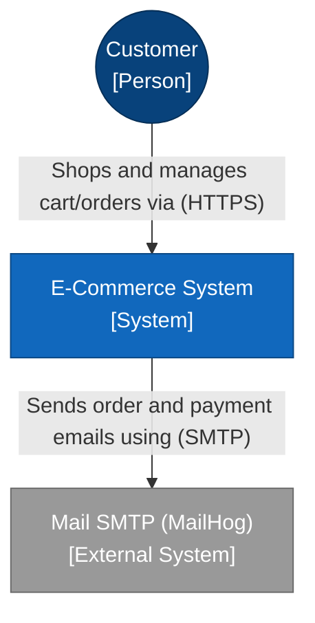
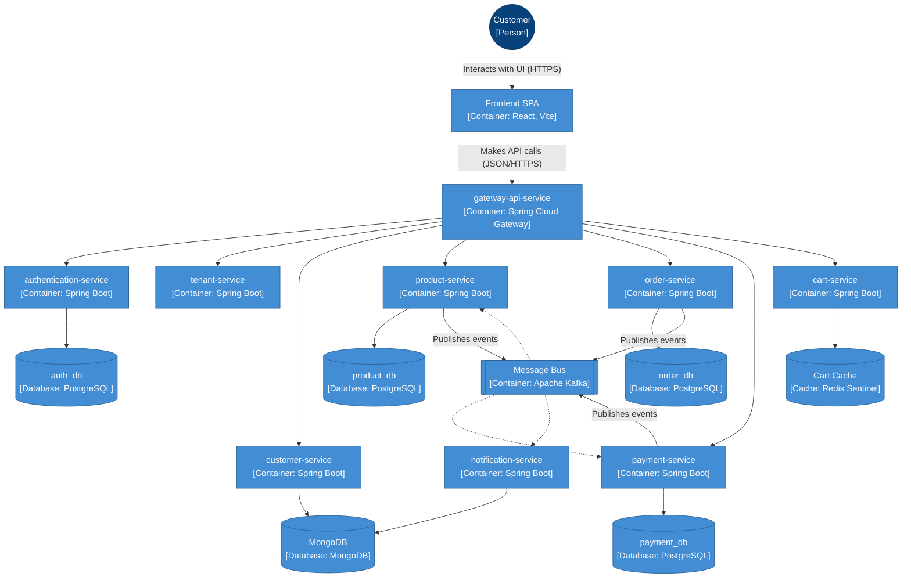
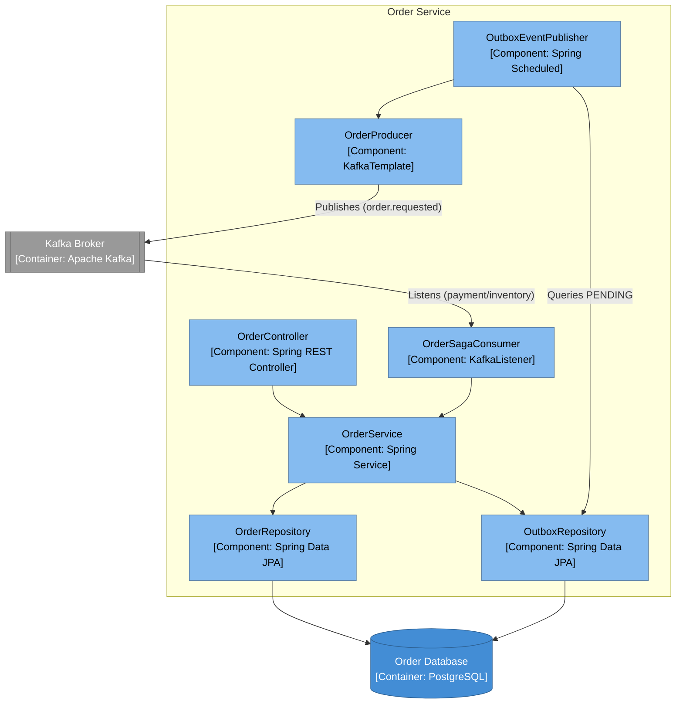
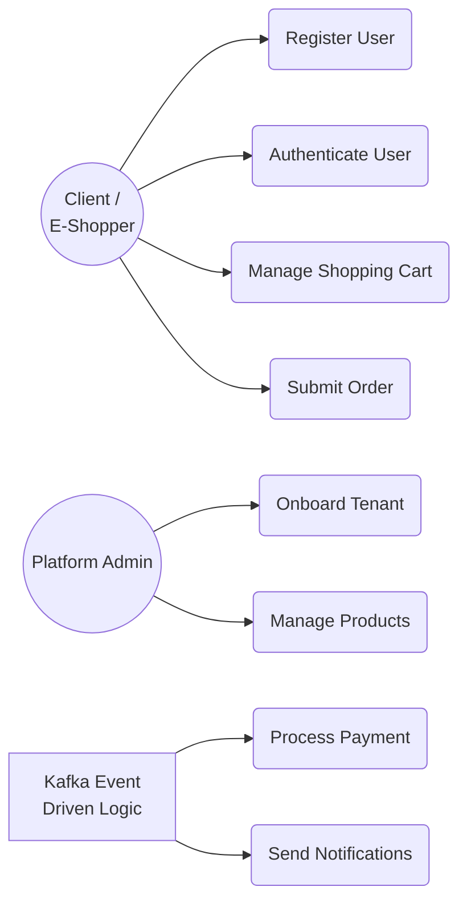
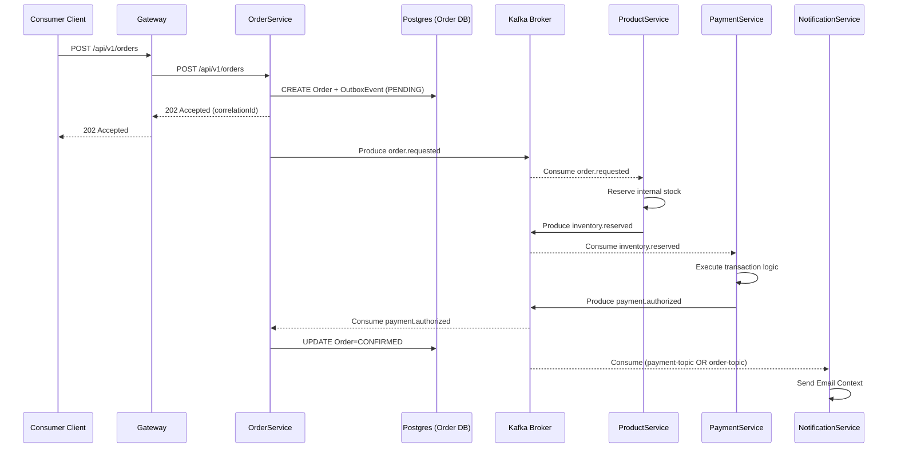
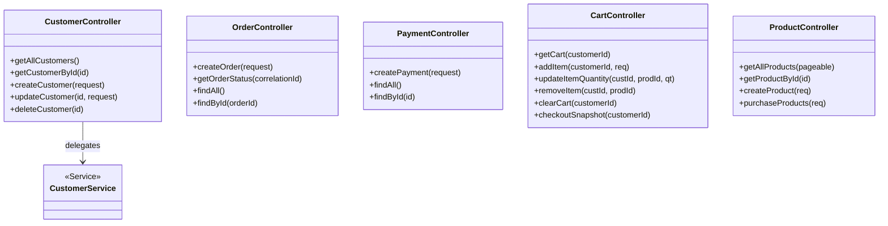
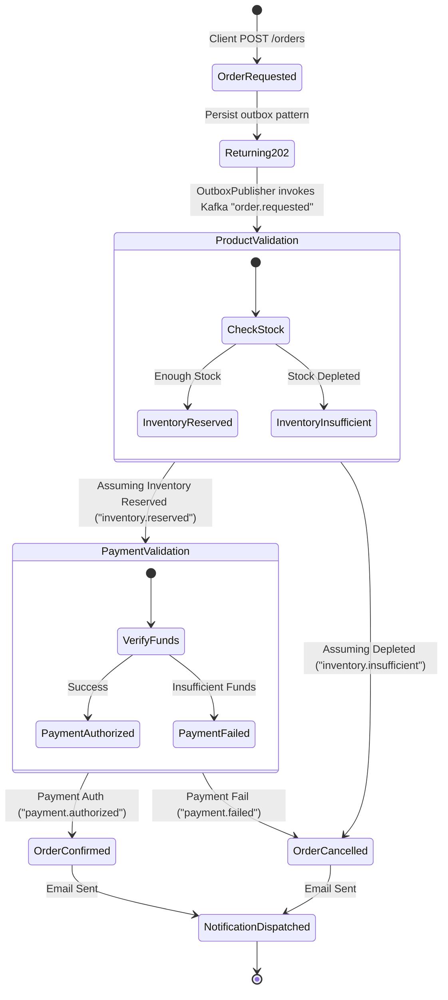

# E-Commerce Microservices System Architecture & Design Documentation

## 1. SYSTEM OVERVIEW
- **Architecture Style**: Event-Driven Microservices (Choreography Saga)
- **System Boundaries**: The system consists of an API Gateway, a frontend application, infrastructural services (config, discovery), and domain-specific microservices communicating synchronously via REST and asynchronously via Apache Kafka. The system includes observability tracking and secrets management.
- **High-Level Components**:
  - Frontend SPA (`frontend`)
  - API Gateway (`gateway-api-service`)
  - Identity & Access Management (`authentication-service`, `tenant-service`)
  - Core Business Services (`customer-service`, `product-service`, `order-service`, `payment-service`, `cart-service`)
  - Support Services (`notification-service`)
  - Infrastructure Services (`config-service`, `discovery-service`, Vault)
  - Message Broker (Apache Kafka, Zookeeper)
  - Persistence Layer (PostgreSQL, MongoDB, Redis)
  - Observability Stack (Zipkin, Prometheus, AlertManager, Loki, Promtail, Grafana)

## 2. USE CASES

### Use Case 1: Onboard Tenant
- **Actors**: User
- **Description**: A user registers a new tenant with a specific subscription plan.
- **Preconditions**: Unique tenant slug/name.
- **Postconditions**: Tenant is created and persisted.

### Use Case 2: Register User
- **Actors**: User
- **Description**: An anonymous user creates a new account.
- **Preconditions**: Unique email address.
- **Postconditions**: User is registered; JWT access and refresh tokens returned.

### Use Case 3: Authenticate User
- **Actors**: User
- **Description**: User authenticates with email and password to receive JWT tokens.
- **Preconditions**: User is registered.
- **Postconditions**: Returns valid JWT access + refresh tokens.

### Use Case 4: Manage Customer Profile
- **Actors**: User, System
- **Description**: Create, read, update, or delete customer profiles. Query by ID or email.
- **Preconditions**: Authenticated user.
- **Postconditions**: Customer profile updated in MongoDB.

### Use Case 5: Catalog and Inventory Management
- **Actors**: Seller, Admin
- **Description**: Create/batch-create, update, or delete products. Check paginated products.
- **Preconditions**: Appropriate RBAC permissions for state mutation.
- **Postconditions**: Catalog updated in PostgreSQL.

### Use Case 6: Manage Shopping Cart
- **Actors**: User
- **Description**: Add items, update quantities, remove items, or clear cart (24h TTL session).
- **Preconditions**: None (Creates cart if absent).
- **Postconditions**: Cart state stored in Redis.

### Use Case 7: Submit Order (Saga Orchestration)
- **Actors**: Customer, System (ProductSvc, PaymentSvc, NotificationSvc)
- **Description**: Submits an order request returning a 202 Accepted. Generates `correlationId`. Initiates asynchronous Saga via events (`order.requested`, `inventory.reserved`, `payment.authorized`).
- **Preconditions**: Cart has items, product inventory is sufficient.
- **Postconditions**: Order is persisted via Outbox pattern, Kafka events are emitted, client can poll status.

### Use Case 8: Process Payment
- **Actors**: System
- **Description**: Receives payment command from Kafka or REST, evaluates charges.
- **Preconditions**: Valid order reference.
- **Postconditions**: Payment record saved, `payment.authorized` or `payment.failed` event emitted. Idempotent key ensures duplicate events are ignored.

### Use Case 9: Send Notifications
- **Actors**: System
- **Description**: Observes order updates and payment events on Kafka (`order-topic`, `payment-topic`). Sends email confirmations. Failed messages are routed to DLQ.
- **Preconditions**: Authorized event pushed to Kafka.
- **Postconditions**: Email sent via MailHog.

---

## 3. SERVICE LANDSCAPE

### 3.1. tenant-service
- **Explicit Responsibility**: SaaS tenant lifecycle management, subscription plans, feature flags, usage metering.
- **Bounded Context**: Tenancy & Billing
- **Database Ownership**: PostgreSQL
- **External Dependencies**: `config-service`, `discovery-service`, Vault

### 3.2. authentication-service
- **Explicit Responsibility**: JWT Auth, RBAC (USER/SELLER/ADMIN), token rotation, user registration.
- **Bounded Context**: Identity & Access Management (IAM)
- **Database Ownership**: PostgreSQL (`auth_db`)
- **External Dependencies**: `config-service`, `discovery-service`, Vault

### 3.3. customer-service
- **Explicit Responsibility**: Customer profile administration.
- **Bounded Context**: Customer Management
- **Database Ownership**: MongoDB
- **External Dependencies**: `config-service`, `discovery-service`, Redis (cache), Vault

### 3.4. product-service
- **Explicit Responsibility**: Product catalog management, pessimistic locking inventory, stock reservation.
- **Bounded Context**: Catalog & Inventory
- **Database Ownership**: PostgreSQL (`product_db`)
- **External Dependencies**: `config-service`, `discovery-service`, Redis (cache), Kafka, Vault

### 3.5. order-service
- **Explicit Responsibility**: Async order creation (Saga Choreography), tracking status, outbox event publishing.
- **Bounded Context**: Order Management
- **Database Ownership**: PostgreSQL (`order_db`)
- **External Dependencies**: `config-service`, `discovery-service`, Kafka, Vault

### 3.6. payment-service
- **Explicit Responsibility**: Idempotent payment processing mapped to orderReferences.
- **Bounded Context**: Payments
- **Database Ownership**: PostgreSQL (`payment_db`)
- **External Dependencies**: `config-service`, `discovery-service`, Kafka, Vault

### 3.7. cart-service
- **Explicit Responsibility**: Fast short-lived (24h TTL) session storage for shopping carts.
- **Bounded Context**: Cart Management
- **Database Ownership**: Redis Sentinel
- **External Dependencies**: `config-service`, `discovery-service`, Vault

### 3.8. notification-service
- **Explicit Responsibility**: Listening to Kafka topics, sending notification emails, processing DLQ events to DB.
- **Bounded Context**: Notifications
- **Database Ownership**: MongoDB
- **External Dependencies**: `config-service`, `discovery-service`, Kafka, MailHog, Vault

### 3.9. gateway-api-service
- **Explicit Responsibility**: API routing, JWT validation, per-tenant rate limiting, circuit breaking, request ID injection.
- **Bounded Context**: Edge/Entrypoint
- **Database Ownership**: Redis (Rate limiting)
- **External Dependencies**: `config-service`, `discovery-service`, Vault

### 3.10. config-service & discovery-service
- **Explicit Responsibility**: Centralized application configurations and Eureka service registry.
- **Bounded Context**: Infrastructure
- **Database Ownership**: None
- **External Dependencies**: Vault

### 3.11. frontend
- **Explicit Responsibility**: Single Page Application (SPA) providing user interfaces for admins, sellers, and customers. Manages global state, form validation, and reactive UI themes.
- **Bounded Context**: User Interface / Client
- **Database Ownership**: None (Uses Zustand for client state and React Query for server state caching)
- **External Dependencies**: `gateway-api-service` (REST API)

---

## 4. API ARCHITECTURE
- **API Style**: REST (Representational State Transfer)
- **API Gateway**: Spring Cloud Gateway enforces rate limiting, tenant tracking, load shedding, and JWT authentication.
- **Authentication**: JWT validation done at the Gateway level (`JwtAuthenticationFilter`) + Service level RBAC.
- **Versioning Strategy**: Path-based (e.g., `/api/v1/`).

---

## 5. API ENDPOINTS

### tenant-service
- `GET /api/v1/tenants` (List tenants)
- `GET /api/v1/tenants/{tenantId}` (Get tenant)
- `GET /api/v1/tenants/by-slug/{slug}` (Get by slug)
- `GET /api/v1/tenants/{tenantId}/validate` (Gateway Validation)
- `POST /api/v1/tenants` (Create - `@Valid CreateTenantRequest`) 
- `PUT /api/v1/tenants/{tenantId}` (Update name/email)
- `PATCH /api/v1/tenants/{tenantId}/plan` (Change plan)
- `PATCH /api/v1/tenants/{tenantId}/suspend` (Suspend API access)
- `PATCH /api/v1/tenants/{tenantId}/reactivate`
- `DELETE /api/v1/tenants/{tenantId}`
- `GET /api/v1/tenants/{tenantId}/flags` (List flags)
- `PUT /api/v1/tenants/{tenantId}/flags/{name}` (Set flag)
- `GET /api/v1/tenants/{tenantId}/flags/{name}/status`
- `POST /api/v1/tenants/{tenantId}/usage` (Record metric)
- `GET /api/v1/tenants/{tenantId}/usage`, `/range`, `/sum` (Query metrics)
- **Validation**: JSR-380 (`@Valid`)
- **Auth**: Authenticated access

### authentication-service
- `POST /api/v1/auth/register` (Register - `RegisterRequest` / Returns `AuthResponse`)
- `POST /api/v1/auth/login` (Login - `LoginRequest` / Returns `AuthResponse`)
- `POST /api/v1/auth/refresh` (Refresh access token)
- `POST /api/v1/auth/logout` (Revoke token)
- **Validation**: JSR-380 (`@Valid`)
- **Auth**: Public except logout/refresh.

### customer-service
- `GET /api/v1/customers` (List customers)
- `GET /api/v1/customers/{id}` (Get via ID)
- `GET /api/v1/customers/by-email?address={id}` (Get via Email)
- `POST /api/v1/customers` (Create - `CustomerRequest` / Validated)
- `PUT /api/v1/customers/{id}` (Update profile - `CustomerRequest` / Validated)
- `DELETE /api/v1/customers/{id}` 

### product-service
- `GET /api/v1/products` (List paginated)
- `GET /api/v1/products/{id}`
- `POST /api/v1/products/create` (Create Product)
- `POST /api/v1/products/batch` (Batch Create Products)
- `PUT /api/v1/products/update/{id}` (Update Product)
- `DELETE /api/v1/products/delete/{id}`
- `POST /api/v1/products/purchase` (Reserved stock list via `ProductPurchaseRequest` / Returns 422 if inadequate stock)

### order-service
- `POST /api/v1/orders` (Async creation - returns 202 with `correlationId`)
- `GET /api/v1/orders/status/{correlationId}` (Poll saga progress)
- `GET /api/v1/orders` (List orders)
- `GET /api/v1/orders/{order-id}`
- `GET /api/v1/order-lines/{order-id}` (Query order items)

### payment-service
- `POST /api/v1/payments` (Process payment via `PaymentRequest`)
- `GET /api/v1/payments` 
- `GET /api/v1/payments/{payment-id}`

### cart-service
- `GET /api/v1/carts/{customerId}`
- `POST /api/v1/carts/{customerId}/items` (`AddCartItemRequest` / Validated)
- `PATCH /api/v1/carts/{customerId}/items/{productId}` (Update quantity)
- `DELETE /api/v1/carts/{customerId}/items/{productId}`
- `DELETE /api/v1/carts/{customerId}` (Clear cart payload in Redis)
- `GET /api/v1/carts/{customerId}/checkout` (Read-only checkout snapshot)

---

## 6. INTER-SERVICE COMMUNICATION
- **Communication Patterns**: Events / Messaging (Kafka), Sync API Calls (Feign Clients / REST)
- **Sync vs Async flows**:
  - Sync: API Gateway → Target Service. Feign requests (`TenantFeignInterceptor`).
  - Async: Saga pattern operations (Order → Product → Payment → Order → Notification).
- **Message Brokers**: `kafka` : 29092 (PLAINTEXT), SASL/PLAIN supported. (Zookeeper dependency).
- **Service Dependency Mapping**:
  - OrderService → Kafka (Producer & Consumer)
  - ProductService → Kafka (Producer & Consumer)
  - PaymentService → Kafka (Producer & Consumer)
  - NotificationService → Kafka (Consumer), Mailhog
  - OrderService uses `PaymentClient`, `CustomerClient` (Feign) if required for metadata reading.

---

## 7. DATA ARCHITECTURE
- **Databases per service** (Database per Microservice pattern enforced):
  - `auth_db` / `order_db` / `product_db` / `payment_db` / `tenant` (PostgreSQL)
  - `customer` / `notification` (MongoDB)
  - `cart` (Redis Sentinel)
- **Data Ownership Model**: Each service has complete autonomy over its underlying database. No foreign keys cross service boundaries.
- **Data Sharing Mechanisms**: Kafka messaging topology; data duplicated explicitly (event-carried state transfer).

---

## 8. INFRASTRUCTURE ARCHITECTURE
- **Containers**: Docker and Docker Compose (Standard, HA, and Prod configurations).
- **Orchestration**: Kubernetes + Helm Charts (`helm/ecommerce`). Includes `hpa.yaml`, `pdb.yaml`.
- **Service Mesh**: Istio (`default-deny.yml`, network policies, mutual TLS).
- **Service Discovery**: Netflix Eureka (`discovery-service`).
- **Load Balancing**: Spring Cloud Gateway + Istio Destination Rules.

---

## 9. CROSS-CUTTING CONCERNS
- **Authentication / Authorization**: Spring Security, JJWT (JWT RS256/HS256). Token expiration. Role validations.
- **Logging / Monitoring**: 
  - Trace: Zipkin.
  - Logs: Loki + Promtail.
  - Metrics: Prometheus (Scraping interval `/actuator/prometheus`).
  - Dashboards: Grafana.
  - Alerts: AlertManager (`alert.rules.yml`).
- **Error Handling**: Standard controller validation + GlobalExceptionHandling logic annotated with `@RestControllerAdvice`. Handled per service (e.g., `CustomerGlobalExceptionHandler`).
- **Configuration Management**: Spring Cloud Config server loaded from Native profile / HashiCorp Vault implementation.
- **Frontend Core**: React 19, TypeScript, Vite, Tailwind CSS + MUI, Zustand (State), React Query (Data Fetching), React Hook Form + Zod (Validation), Playwright + Vitest (Testing).

---

## 10. SYSTEM FLOW (Choreographed Saga Lifecycle)

1. Client POST `/api/v1/orders`. 
2. Gateway checks tokens and delegates to `order-service`.
3. `order-service` writes to DB (`Order` + `OutboxEvent`) locally in a transaction. (Returns HTTP 202 Accepted + `correlationId`).
4. Outbox scheduled publisher fires `order.requested` via Kafka.
5. `product-service` subscribes -> Reserves inventory. Yields `inventory.reserved`.
6. `payment-service` subscribes to `inventory.reserved` -> processes logic. Yields `payment.authorized` (or failed).
7. `order-service` picks up `payment.authorized` -> Transitions status to `CONFIRMED`.
8. `notification-service` consumes confirmed events -> Submits email.
9. Client queries `GET /api/v1/orders/status/{correlationId}` recursively until saga completes.

---

## 11. C4 MODEL (MERMAID)

### 11.1 CONTEXT DIAGRAM

### 11.2 CONTAINER DIAGRAM

### 11.3 COMPONENT DIAGRAM 
*(For `order-service` as an example from the explicit code findings)*

---

## 12. UML DIAGRAMS

### 12.1 USE CASE DIAGRAM

### 12.2 SEQUENCE DIAGRAM (Order Generation Flow)

### 12.3 CLASS DIAGRAM
*(Based on explicit components observed in code - Persistence structure inference)*

### 12.4 ACTIVITY DIAGRAM (Saga Choreography Activity)

